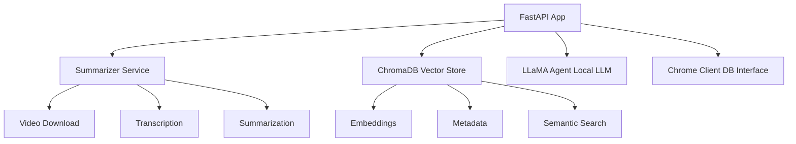

# Social Brain

[](LICENSE)
[](https://www.python.org/downloads/)

**Social Brain** is an AI-powered knowledge management system that transforms social media content—like Instagram Reels and (soon) Twitter bookmarks—into a searchable, conversational knowledge base using advanced AI/ML models.

## 🚀 Project Overview

Built from scratch to explore AI/ML integration and local LLM deployment, Social Brain demonstrates:
- Scalable Python backend architecture (FastAPI)
- Integration of state-of-the-art models (OpenAI Whisper, LLaMA)
- Use of vector databases (ChromaDB) for semantic search
- Hands-on learning in a new language and ecosystem

## Why This Project?
As a senior backend engineer, I wanted to:
- Deepen my practical AI/ML skills
- Experiment with local LLMs and vector search
- Build a real-world application outside my professional Node.js/TypeScript comfort zone
- Create a foundation for multi-source social media knowledge aggregation (Instagram, Twitter, etc.)

## Learning Experience
- **AI/ML Integration:** Implemented Whisper for transcription, LLaMA for chat, and ChromaDB for semantic search
- **Python Ecosystem:** Gained hands-on experience with FastAPI, async programming, and Python packaging
- **Architectural Challenges:** Designed a modular, extensible backend for future social media sources
- **Experimentation:** Tackled model deployment, vector storage, and multi-modal data processing

## Features

### 🎬 Content Processing Pipeline
- **Video Download:** Supports Instagram Reels and other platforms via `yt-dlp`
- **Audio Transcription:** Uses OpenAI Whisper for accurate speech-to-text
- **AI Summarization:** Generates summaries using advanced AI models
- **Vector Storage:** Stores content in ChromaDB for fast semantic search

### 🤖 AI-Powered Chat Interface
- **Semantic Search:** Finds relevant content based on query meaning
- **Contextual Responses:** Uses local LLaMA model for intelligent answers
- **Multi-document Synthesis:** Combines insights from multiple stored videos

### 📚 Content Management
- **Persistent Storage:** Long-term retention of processed content
- **Metadata Tracking:** Preserves source URLs and processing details
- **Collection Inspection:** View and manage stored content

## Technology Stack
- **FastAPI**: Modern Python web framework
- **OpenAI Whisper**: Speech recognition
- **LLaMA**: Local LLM for chat
- **ChromaDB**: Vector database
- **yt-dlp**: Video downloading

## Installation

### Prerequisites
- Python 3.8+
- FFmpeg
- Git

### Setup
```bash
git clone <repository-url>
cd social-brain
python -m venv venv
source venv/bin/activate  # On Windows: venv\Scripts\activate
pip install -r requirements.txt
python main.py
```
Open your browser to `http://localhost:8000` to access the web interface.

## API Endpoints

### Process Video Content
```http
POST /process/
Content-Type: application/x-www-form-urlencoded
url=https://instagram.com/reel/example
```

### Chat with Knowledge Base
```http
GET /api/chat/?query=your_question&collection_name=default&n_results=5
```

### Inspect Stored Content
```http
GET /inspect
```

## How It Works
1. **Ingest:** Submit a video URL to `/process/`
2. **Process:** Download, transcribe, summarize, embed, and store
3. **Query:** Use `/api/chat/` to ask questions about your content
4. **Respond:** Retrieve context and generate answers with LLaMA

## Use Cases
- **Content Creators:** Organize and search inspiration
- **Researchers:** Build a searchable database of video insights
- **Learning:** Personal knowledge base from educational content
- **Business Intelligence:** Analyze competitor content

## Architecture


## Project Structure
```
social-brain/
├── api/
├── services/
├── models/
├── static/
├── downloads/
├── chroma_db/
└── main.py
```

## Configuration
- Model settings: service files
- Database: ChromaDB location
- API: FastAPI in `main.py`

## Future Plans
- **Twitter Bookmark Integration:** Aggregate and reason over Twitter bookmarks as knowledge sources
- **More Social Platforms:** Extend to YouTube Shorts, TikTok, etc.
- **Enhanced Analytics:** Add usage metrics and advanced search

## Contributing
1. Fork the repository
2. Create a feature branch
3. Make your changes
4. Add tests if applicable
5. Submit a pull request

## License
MIT
