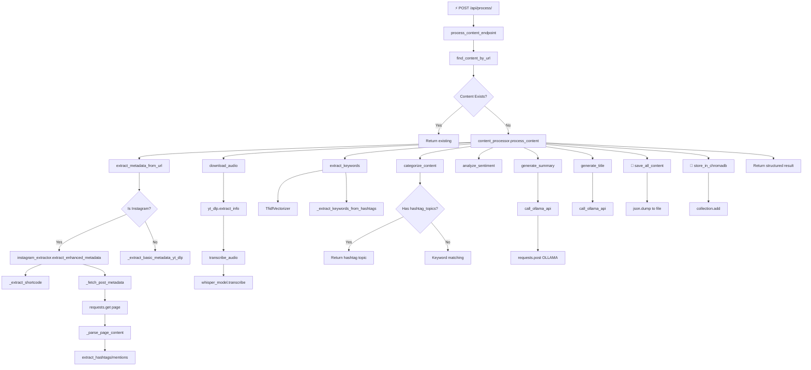
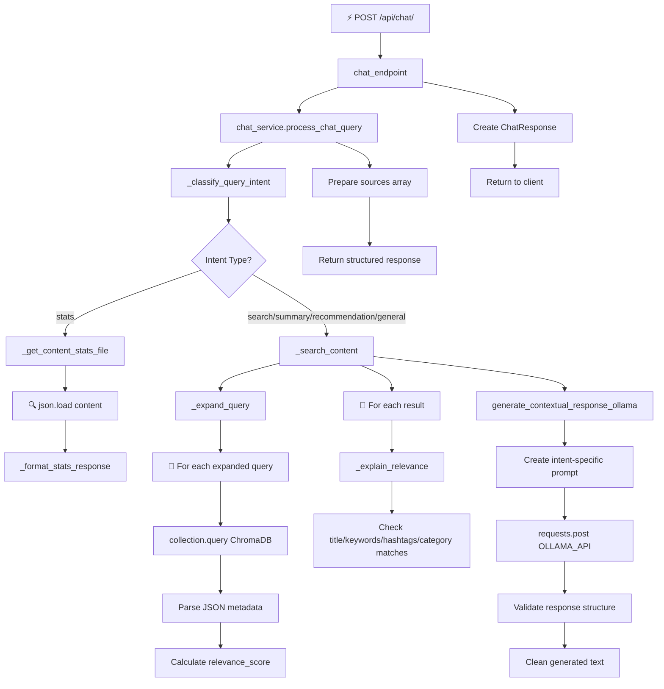
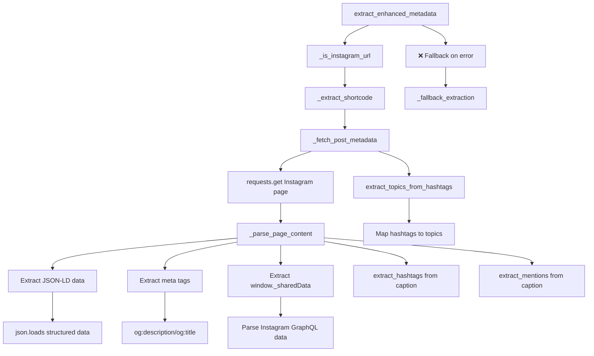

# Function Call Diagram & Event Flow

## Visual Function Call Relationships

### Legend
- `→` Direct function call
- `↓` Control flow continuation  
- `⚡` Event trigger
- `🔄` Loop/iteration
- `❌` Error handling
- `💾` Data storage
- `🔍` Data retrieval

---

## Event Flow Diagrams

### 1. Content Processing Event Flow



### 2. Chat Query Event Flow



### 3. Instagram Extraction Flow



---

## Function Dependency Map

### Core Service Dependencies

```
main.py
├── api/ingest.py
│   ├── services/content_processor.py
│   │   ├── services/instagram_extractor.py
│   │   ├── whisper (external)
│   │   ├── yt_dlp (external)
│   │   ├── sklearn.TfidfVectorizer
│   │   └── requests (for Ollama)
│   ├── chromadb.PersistentClient
│   └── json (file storage)
│
└── api/chat.py
    ├── services/chat_service.py
    │   ├── services/llama_agent.py
    │   │   └── requests (for Ollama)
    │   ├── chromadb.PersistentClient
    │   └── json (file storage)
    └── json (file loading)
```

### External Service Dependencies

```
Application
├── Ollama API (http://localhost:11434)
│   ├── Used by: content_processor.py (summarization, title generation)
│   ├── Used by: llama_agent.py (chat responses)
│   └── Fallback: Continue without AI features
│
├── ChromaDB (./chroma_db/)
│   ├── Used by: ingest.py (vector storage)
│   ├── Used by: chat_service.py (semantic search)
│   └── Fallback: File-based search only
│
├── Whisper Model (local)
│   ├── Used by: content_processor.py (transcription)
│   └── Fallback: Processing fails
│
├── yt-dlp (external tool)
│   ├── Used by: content_processor.py (video/audio download)
│   └── Fallback: Processing fails
│
└── File System
    ├── data/content.json (primary storage)
    ├── ./chroma_db/ (vector database)
    ├── downloads/ (temporary audio files)
    └── static/ (web interface)
```

---

## Error Propagation Map

### Critical Errors (Stop Processing)
```
whisper_model = None → transcribe_audio() → ValueError → process_content() → HTTP 500
yt_dlp failure → download_audio() → Exception → process_content() → HTTP 500
Ollama timeout → call_ollama_api() → requests.Timeout → fallback response
File write error → save_all_content() → Exception → process_content() → HTTP 500
```

### Non-Critical Errors (Continue Processing)
```
ChromaDB error → store_in_chromadb() → log error → continue
Instagram extraction error → extract_enhanced_metadata() → fallback extraction
Ollama error → generate_summary() → "Failed to generate summary"
Empty search results → _search_content() → return [] → "No content found"
```

---

## State Transitions

### Content Processing States
```
Initial → Metadata Extraction → Audio Download → Transcription → 
AI Analysis → Storage → Complete

Error States:
├── Metadata Extraction Failed → Return Error
├── Audio Download Failed → Return Error  
├── Transcription Failed → Return Error
├── Storage Failed → Return Error
└── AI Analysis Failed → Continue with fallback
```

### Chat Query States
```
Query Received → Intent Classification → Content Search → 
AI Response Generation → Response Formatting → Complete

Error States:
├── Invalid Query → Return Validation Error
├── Search Failed → Return "No Content Found"
├── AI Generation Failed → Return Formatted Search Results
└── Unexpected Error → Return Generic Error Message
```

---

## Performance Critical Paths

### High-Impact Operations (>1s typical)
1. **Audio Download** (yt_dlp) - 5-30s depending on video length
2. **Audio Transcription** (Whisper) - 10-60s depending on audio length  
3. **AI Summarization** (Ollama) - 5-15s depending on text length
4. **AI Chat Response** (Ollama) - 3-10s depending on complexity

### Low-Impact Operations (<100ms typical)
1. **Metadata Extraction** - 100-500ms
2. **Keyword Extraction** (TF-IDF) - 10-50ms
3. **Content Storage** (JSON) - 1-10ms
4. **Vector Storage** (ChromaDB) - 10-100ms
5. **Semantic Search** (ChromaDB) - 10-50ms

---

## Concurrency & Thread Safety

### Thread-Safe Operations
- File-based JSON storage (atomic writes)
- ChromaDB operations (thread-safe by design)
- HTTP requests (per-request isolation)
- Logging operations (thread-safe)

### Potential Race Conditions
- Multiple simultaneous content processing of same URL
- Concurrent file writes to content.json
- Whisper model loading during startup

### Mitigation Strategies
- Duplicate URL check before processing
- Atomic file operations with temp files
- Single-threaded model loading on startup