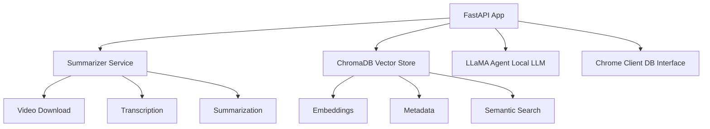

# Instagram Reels AI Agent

[](LICENSE)
[](https://www.python.org/downloads/)

An intelligent personal knowledge management system that transforms Instagram Reels and other video content into a searchable, conversational knowledge base using AI.

## Overview

This project enables you to ingest video content from URLs, automatically transcribe and summarize the content using AI models, store the insights in a vector database, and then chat with your accumulated knowledge using natural language queries.

## Features

### 🎬 Content Processing Pipeline
- **Video Download**: Supports Instagram Reels and other platforms via `yt-dlp`
- **Audio Transcription**: Uses OpenAI Whisper for accurate speech-to-text conversion
- **Dual AI Summarization**: Generates summaries using advanced AI models
- **Vector Storage**: Stores content in ChromaDB for fast semantic search

### 🤖 AI-Powered Chat Interface
- **Semantic Search**: Finds relevant content based on query meaning, not just keywords
- **Contextual Responses**: Uses local LLaMA model to generate intelligent responses
- **Multi-document Synthesis**: Combines insights from multiple stored videos

### 📚 Content Management
- **Persistent Storage**: Long-term retention of processed content
- **Metadata Tracking**: Preserves source URLs and processing details
- **Collection Inspection**: View and manage stored content

## Technology Stack

- **FastAPI**: Modern Python web framework with automatic API documentation
- **OpenAI Whisper**: State-of-the-art speech recognition
- **LLaMA**: Large language model for contextual chat responses
- **ChromaDB**: Vector database for semantic search and retrieval
- **yt-dlp**: Robust video downloading from various platforms

## Installation

### Prerequisites
- Python 3.8+
- FFmpeg (for audio processing)
- Git

### Setup
1. Clone the repository:
   ```bash
   git clone <repository-url>
   cd reels-ai-agent
   ```

2. Create a virtual environment:
   ```bash
   python -m venv venv
   source venv/bin/activate  # On Windows: venv\Scripts\activate
   ```

3. Install dependencies:
   ```bash
   pip install -r requirements.txt
   ```

4. Run the application:
   ```bash
   python main.py
   ```

5. Open your browser to `http://localhost:8000` to access the web interface.

## API Endpoints

### Process Video Content
```http
POST /process/
Content-Type: application/x-www-form-urlencoded

url=https://instagram.com/reel/example
```

Processes a video URL, transcribes the audio, generates summaries, and stores in the knowledge base.

### Chat with Knowledge Base
```http
GET /api/chat/?query=your_question&collection_name=default&n_results=5
```

Query your accumulated knowledge using natural language. The system will find relevant content and provide contextual responses.

### Inspect Stored Content
```http
GET /inspect
```

View all stored content and metadata in your knowledge base.

## How It Works

1. **Ingest**: Submit a video URL to the `/process/` endpoint
2. **Process**: The system downloads the video, extracts audio, transcribes it with Whisper, and generates summaries
3. **Store**: Combined summaries are embedded and stored in ChromaDB
4. **Query**: Use the `/api/chat/` endpoint to ask questions about your content
5. **Respond**: The system retrieves relevant context and generates intelligent responses using LLaMA

## Use Cases

- **Content Creators**: Organize and search through inspiration from other creators
- **Researchers**: Build a searchable database of video insights and trends
- **Learning**: Create a personal knowledge base from educational content
- **Business Intelligence**: Track and analyze competitor content strategies

## Architecture



## Project Structure

```
reels-ai-agent/
├── api/                  # FastAPI endpoints
│   ├── chat.py          # Chat interface
│   ├── ingest.py        # Content processing
│   └── inspect.py       # Database inspection
├── services/            # Core business logic
│   ├── chat_service.py  # Chat functionality
│   ├── content_processor.py # Video processing
│   ├── llama_agent.py   # LLaMA integration
│   └── summarizer.py    # Content summarization
├── models/              # Data models
├── static/              # Web interface
├── downloads/           # Temporary file storage
├── chroma_db/           # Vector database
└── main.py             # Application entry point
```

## Configuration

The application uses default settings that work out of the box. For advanced configuration:

- **Model Settings**: Modify model parameters in service files
- **Database**: ChromaDB storage location can be configured
- **API**: FastAPI settings in `main.py`

## Contributing

1. Fork the repository
2. Create a feature branch
3. Make your changes
4. Add tests if applicable
5. Submit a pull request

## License

This project is open source. Please check the license file for details. 